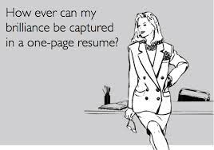
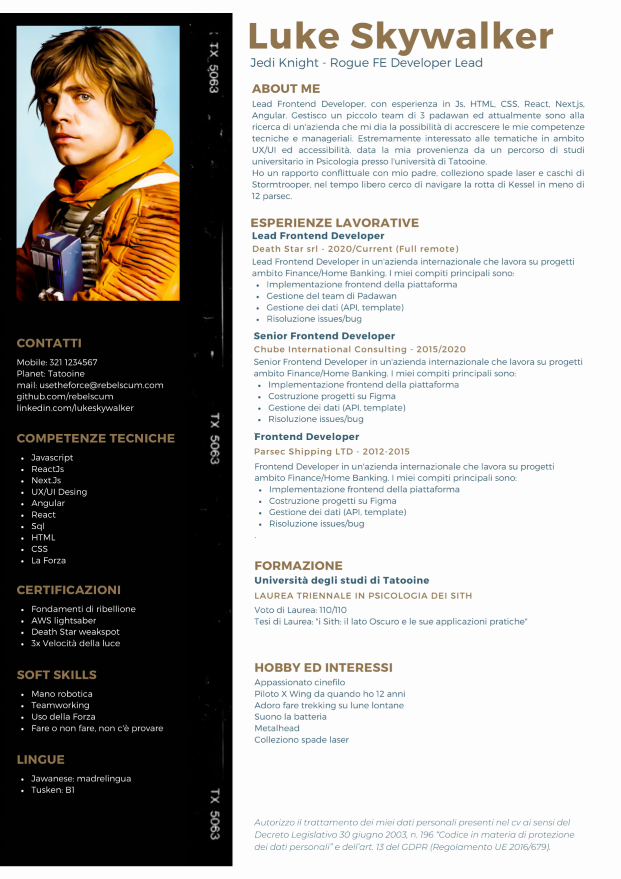
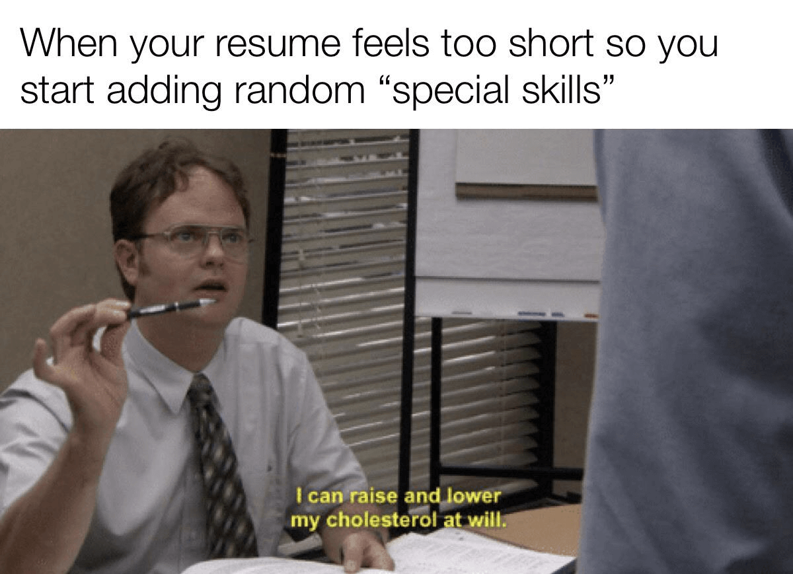

# Guida Galattica per il CV

*First of all read this well, VERY WELL! This Guide is focused on building a CV suitable for the ITALIAN job market. Later, the goal is to grow the project and write guides in other languages as well and modify the directions, adapting them to other nations and related markets.*

## Indice
  1. [General Info](#1-general-info)
  2. [The photo](#2-the-photo)
  3. [Contacts](#3-contacts)
  4. [About Me](#4-about-me)
  5. [Professional Experiences](#5-professional-experiences)
  6. [Training Experiences](#6-training-experiences)
  7. [Tecn Skills](#7-tech-skills)
  8. [Soft Skills](#8-soft-skills)
  9. [Courses and Certifications](#9-courses-and-certifications)
  10. [Languages and Hobbies](#10-langueages-and-hobbies)
  11. [Data Processing Authorization ](#11-data-processiong-authorization)
  12. [Final Considerations](#12-final-considerations)

## 1) General info

Let's start with a fundamental assumption: the perfect CV does NOT EXIST, just as there is no such thing as "the ATS-proof CV" (Applicant Tracking System). The directions I will give you in this project will be technical/qualitative/aesthetic, to give you the ability to build a functional CV, containing the right mix of keywords, description of professional experience, soft skills, and more. Some useful tips before you start:

- It's a good idea to try to build a one-page CV (it takes an experienced recruiter 10-20 seconds to read one) to immediately capture the interest and attention of those who will receive the document. Content is king, but the eye wants its share, too!
- As you will see in the CV example below, written specifically for this project (yes, I love Star Wars, can you tell?), the CV should be concise but comprehensive, containing all the keywords needed for the position for which you are applying
- Pay attention to the language in which the job description is written! If the job is written in English, it is always best to send the CV in English; if in Italian, send it in Italian. Having two versions of the CV is always a good idea, btw
- I STRONGLY recommend not using the Europass format, which is outdated and has no possibility of graphic customization (I created the example CV on [Canva](https://www.canva.com/), which contains hundreds of good templates, but you could also use [LaTeX](https://www.latextemplates.com/) or also [OverLeaf](https://www.overleaf.com/))

So here is the CV: I chose a template that is aesthetically very minimal but which, in my opinion, works very well.

## 2) The Photo

Regarding the age-old question "but do I put the photo in the CV or not?" the answer I always provide is "do as you please." But, PLEASE, if you decide to include it, remember some simple rules:
- Prefer a half-length photo, professionally done and where you are portrayed facing or slightly to the side
- AVOID grainy or very old photos
- AVOID photos that depict you at the beach, at a party, with cocktails/dogs/kittens/whatever in your hand
- AVOID photos that are obviously group photos that you have cropped (badly)
- AVOID winking photos, with skimpy or provocative clothes. It's a CV, not a modeling book.
- If you don't have a professional photo of yourself, an avatar/illustration of yourself is fine (you're still a dev, a minimum of creativity is fine), but always try to keep it within the bounds of professional

I have also read numerous debates where it was said that removing the photo from the CV would eliminate unconscious bias about gender, ethnicity, particular somatic traits, and so on. I partially agree with this philosophy, although in any case, biases and prejudices can arise from a multitude of things (e.g., is your name Mario? I HATE people named Mario and will discard your CV) so here, eliminating the photo might eliminate some of the bias regarding "aesthetics" but it doesn't eliminate all of them. Ergo, the choice of whether or not to include the photo in the CV is very personal and has no defined rule. It is up to you, but just follow the directions above.

## 3) Contacts

Believe it or not, I get a lot of CVs without, for example, the e-mail address and/or cell phone number. INSANE!!! Watch out for the contact section, because it is FUNDAMENTAL. Graciously, if we don't have your phone number or email, how do we contact you? Sending pigeons? Again, a few simple rules:

- Remember to include all useful contacts, as in the sample CV
- Choose a professional e-mail address (we avoid e-mails like devils88 or bananakiller83)
- Include links to your LinkedIn profile, GitHub (and if you have online portfolios of that too). Make these links clickable to make it easy for someone reading your CV to quickly open the link without having to copy-paste every time

## 4) About Me

This section of the CV is, to say the least, FUNDAMENTAL. It will allow you to summarize in a few lines your professional experience, the technologies/languages you know or are learning more about, your work and personal goals, and you could also provide some "extra" insights related perhaps to personal projects you follow in your spare time, hobbies, or anything else that you think might be of interest.

The about me is one of the first things that CV evaluators read and allows them to get an initial overview of who you are, what you have done, and especially what you are looking for in your professional future. In Luke's sample CV you will be able to see that the about me has basically all the necessary elements: the current job title, the technologies/languages Luke is familiar with, he indicates that he manages a team of juniors, he writes what he is looking for in the future. In addition, he talks about his interest in other technical topics related to the FE role and finally provides an overview of his free time and hobbies, which as we will see in the dedicated section are an interesting tool for a conversation hook with those who will have to evaluate you.

## 5) Professional Experiences

Obviously, the professional experiences are the heart of the whole CV: in this section the main objective is to find the right compromise between being concise but at the same time exhaustive in telling what you have done in your professional career and highlighting the most relevant projects, technologies used, etc. In Luke's CV example you will notice some standardization of the layout, this is because the CV constructed in this way will be more readable, more streamlined but at the same time complete with all useful info, such as:

- Starting and ending dates of professional experience, complete with the name of the company
- Demonstration of consistent professional growth: in the example cv, good Luke starts in 2012 as FE Dev and then grows as Senior FE to last experience as Team Lead. This professional growth in terms of roles and responsibilities jumps out at an experienced recruiter/selector and provides an overview
- Bullet points that succinctly but effectively describe key duties, projects followed, technologies used, and other information you feel is relevant to the specific position you are seeking
Of course, the proposed example CV is of a senior profile, consequently bringing out the professional growth and in terms of responsibilities and tasks performed is easier because the years of experience are multiple; however, even for less structured profiles you can effectively highlight the same things, I will elaborate on this in the final paragraph.

## 6) Training Experiences

As you may notice from Luke's sample CV, I have only included the degree, related grade and title of the thesis (interesting because it may help to bring up a possible talking point with the recruiter). Obviously in this specific case he is a senior profile, so I preferred to include only the educational experience related to the degree.

If, on the other hand, you are a junior profile, it makes absolute sense to also include the degree track and related grade (obviously if you are not a graduate, only the degree). If you are attending university, a PhD or master's degree you should definitely include it in your CV, to access a curricular internship for example. In general, any training you are pursuing should be reported in your CV for a twofold purpose: on the one hand to signal to those evaluating your CV that you are training and following a certain path and also because, for sure, you will need a certain number of hours of study leave to prepare for the exams you will then have to take, and this is information that those evaluating you absolutely must have!

Ditto if you are following an Academy/Bootcamp in IT: it is a training course (vertical on IT, but still a training course) and it must be included, complete with the technologies you are studying, the expected end date of the Academy and the practical project(s) on which you "got your hands dirty".

## 7) Tech Skills

Along with professional experience, the heart of any CV, in your case this section is definitely very important. It clearly allows you to neatly and concisely list all the technical skills you have acquired (or are in the process of acquiring, perhaps flagging them with a "work in progress" or more graphically with a progress bar). CAUTION: Many companies use ATSs, which may not recognize graphic signs (such as stars or progress bars related to how much expertise you have on that technology).

It would definitely be preferable to list them by including in the first positions the technologies/languages on which you are most proficient or that you use on a daily basis, so as not to "confuse" those who are reading your CV (if you are applying as an FE, it definitely makes sense that as the first technologies/languages in the list there are FE languages/FWs, and then maybe in the last positions of the list you include BE languages/FWs, databases or other).

It is also extremely useful in allowing the ATS to tap into the right keywords related to the technologies sought by the company/selector. The ATS is nothing more than software that helps recruiters with a whole range of repetitive and low-value-added tasks and also serves as a database of CVs and applications, as well as the multiposting of a job ad on several portals at once. It is therefore most important to include in the CV all the keywords necessary to make the CV "stand out" among the several that the company will receive (on the ATS there are a number of false myths to be absolutely debunked, first and foremost that of the "automatic reading" of the CV: recruiters read all CVs, I assure you. Quite simply, the ATS helps filter out CVs that are "closest" to the ad posted).

## 8) Soft Skills

Regarding soft skills there are various schools of thought: some think that for a "technical" job like dev they are useless, and some think that they are essential. Personally, I find that any professional (so not only a dev) has to build his professionalism 50% on hard skills and 50% on soft skills: one cannot think of being a dragon technically but totally lacking in communication skills, teamworking, empathy, proactivity and much more. Contrary to popular belief, the job of the dev is not a robotic job, but it needs a very large "human" component that resides precisely in soft skills, which need to be nurtured and built, just like hard skills.

I therefore consider it very important to include them in the CV but with a small reminder: STOP with the usuals soft skills, try to write a list of "real" soft skills or at least really dropped on your personality and way of being: if you are, for example, a very meticulous person who needs order and routine, you will probably not be a person who works well under stress or at speed (and there is nothing wrong with not being that kind of person), so writing "I work well under pressure" is disingenuous (as well as one of the “classic” soft skills mentioned above).

In the example CV, clearly, the soft skills I have included are intentionally goliardic (as is almost everything else on the CV after all). But regarding this section, I'd like you to do a little "mental exercise" and find the soft skills that you think really characterize you. They can be a great conversation starter with those who will be evaluating you

  

## 9) Courses and Certifications

Many companies, as a mandatory requirement for some positions, require specific certifications. As a result, this section is important precisely to signal that you have completed certain courses or hold certifications that are recognized, often even globally. It is also a useful section to demonstrate your personal commitment and willingness to increase your technical skills.  

I often come across courses and certifications on Scum/Agile/PM in CVs, for example, and I always use them as a conversation starter: they often denote a willingness on the part of the person I'm interviewing to want to grow professionally and thus a signal like, "hey see, I have a PM certification, that's what I want to do 'when I grow up'!" And that's something I really appreciate :)

## 10) Languages and hobbies

Ninety percent of the CVs I receive do NOT have a hobbies section, and to me that is a huge shame! I personally find it the most interesting (and in some cases, fun) section of the entire CV. It allows me to get to know the professional as a person, and not just as a technician. It also provides me with a lot of useful conversation starters to glean additional points of view, ways of looking at things, goals achieved, and more.

For example, a person who plays extreme sports will likely have a healthy propensity to push their limits, curiosity to try new things, and certainly courage. A person who plays team sports, on the other hand, will definitely be used to working in teams, collaborating, and will tend not to be a "lone wolf." Hobbies tell so much about you, include them in your CV! About languages little to say: this is 2023, I consider it FUNDAMENTAL to at least know another language (preferably English) besides Italian. Again, any certifications on languages, if you have them, include them in your CV in this section.

## 11) Data Processing Authorization

Legislative Decree No. 101 of August 10, 2018, established that consent to the processing of personal data in the CV is no longer required. This means that under the new privacy legislation, it is not mandatory to include the data processing consent in the CV. Each candidate can freely choose to include it or not. Having said that, I still recommend including the sentence that you can safely copy from the sample CV for several reasons:

- Inserting the Authorization to the Processing of Personal Data in one's Curriculum Vitae means authorizing those who receive the CV (the employer, HR managers, and recruiters) to process the data covered and protected by the Italian Privacy Law and the GDPR - General Data Protection Regulation, in force in all European Union countries since May 25, 2018
- While it is not compulsory to include the data processing authorization in the CV, it is useful to do so because you immediately allow the employer to use your personal data to be contacted for an interview or to keep it for future selections
- If the employer receives a CV without authorization, he or she must request the candidate's authorization by providing full details on how the data will be used. Only after receiving this consent can it use them, consequently as you can well imagine this leads to delays in the selection process and an additional "layer" of bureaucracy that can be safely avoided!

## 12) Final considerations

What more to say? If you have reached the end of this never-ending rant on building a good CV all that remains is to put into practice the directions provided and send it to the companies that interest you!

Remember that the CV is a showcase of yourself: of your professional experiences first of all, but also of your educational background, your passions, your soft skills and your desire to find the "right place" for you. Thus, the CV should not be seen as a sterile shopping list of technologies/languages/certifications but somehow must manage to tell about yourself, in a certainly concise but coherent way. It is the first business card of yourself that gets into the hands of the people who are likely to hire you and with whom you will work. So, invest a few hours in building your CV and you will not regret it!

